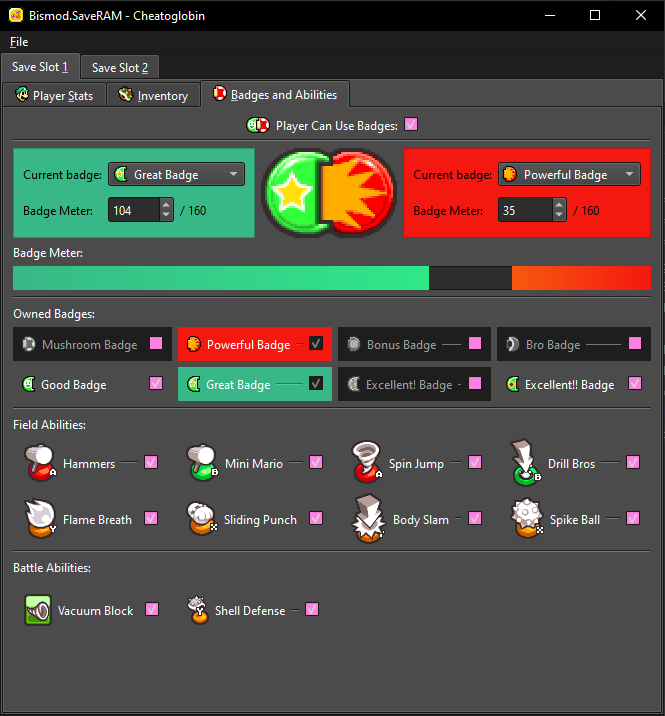

# Cheatoglobin
Cheatoglobin is a save editor for Mario and Luigi: Bowser's Inside Story.



This program is still in development, and will likely see far more features in the future.
All of Cheatoglobin's testing was done on the North American version of the ROM, so issues may arise when editing save files from other versions.

Cheatoglobin icon created by MiiK: https://bsky.app/profile/miikheaven.bsky.social

# Running the Program
There are 4 ways to run this program, from easiest to most complicated:

1. Download the binary from [Releases](https://github.com/MnL-Modding/Cheatoglobin/releases) and run it. (Use the `.exe` for Windows, and the `.bin` for Linux)

2. Install the package with
```bash
python3 -m pip install --force-reinstall git+https://github.com/MnL-Modding/Cheatoglobin
```
and run it with `cheatoglobin` or `python3 -m cheatoglobin`.

3. Clone the repository, install the dependencies with Poetry (assuming you already have Poetry installed with `python3 -m pip install poetry`):
```bash
poetry install
```
and run the program through Poetry:
```bash
poetry run cheatoglobin
```

4. Clone the repository, install the dependencies through `pip` with:
```bash
python3 -m pip install -r requirements.txt
```
and run it from the current directory with `python3 -m cheatoglobin`. Alternatively, it can be run through the `run.bat` if you use Windows.
